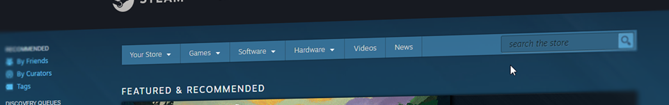
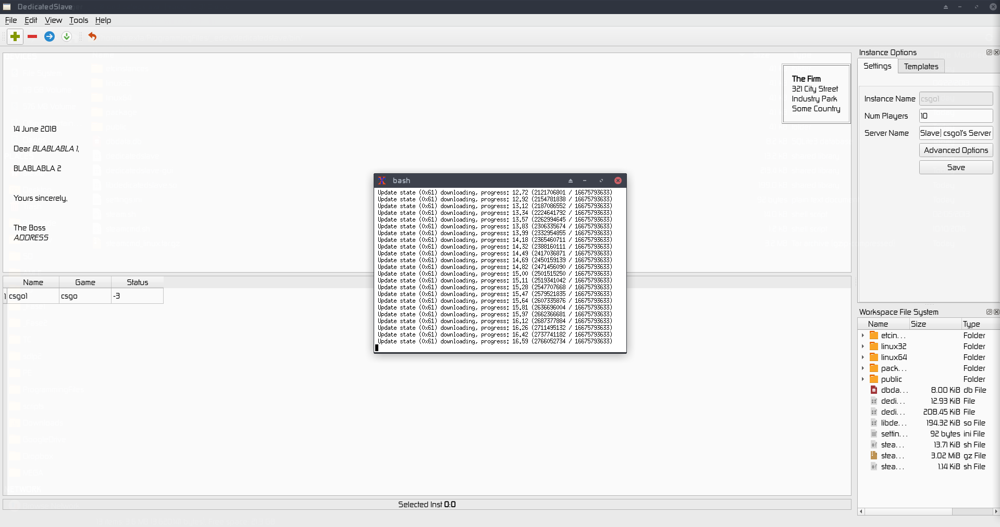
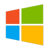

# Dedicated Slave

---

A cross platform desktop app tool to manage steam dedicated game servers with&nbsp;SteamCMD

---

## Overview

DedicatedSlave is a shell tool for bootstrapping game servers

### Create

With DedicatedSlave creating game servers is not a problem.n You can create as many servers as you want.

### Config

DedicatedSlave allow you to config game servers with a simple file.

### Launch

Allow you to quickly launch any server from any platform.

## Supported Platforms

## Features

* A dedicated server manager, that can start/stop/create/delete/backup/restore game instances.
* Custom game options

## Roadmap

* Game Instances Custom Options
  * CSGO
    * ESL Config
    * Plugins
      * Zombies
* Config
* Verify if any folder exist and is not in db
* Update system
* Documentation (Doxygen ??)
* Colors Output Stdout
